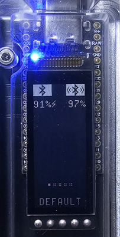

# nice-view-central-relay

Fork of [nice-view-gem](https://github.com/M165437/nice-view-gem) with central states relay support.

### Fork features

- **Peripheral central relay screen** — shows dual-column status on the peripheral display using [zmk-central-states-relay](https://github.com/ArtemYurov/zmk-central-states-relay):
  - Left column: peripheral BT connection + battery
  - Right column: central BT/USB connection + battery
  - Bottom: BT profile dots + layer name from central
- Enable with `CONFIG_NICE_VIEW_GEM_PERIPHERAL_CENTRAL_RELAY=y` — upstream functionality is fully preserved when disabled



### A sleek customization for the nice!view shield

Add this shield to your keymap repo (see usage below) and run the GitHub action to build your firmware.

### Features

- Uses a **fixed range for the chart and gauge deflection**. 📈
- Includes a **beautiful animation** for the peripheral of split keyboards. 💎
- Comes with **pixel-perfect symbols** for BLE and USB connections. 📡

## Usage

To use this shield, first add it to your `config/west.yml` by adding a new entry to remotes and projects.

> [!IMPORTANT]
> Always pin both ZMK and this module to matching revisions.
>
> - ZMK `v0.3` → use the `zmk-v0.3` branch
> - ZMK `main` (Zephyr 4.1+) → use the `main` branch

```yml
manifest:
  remotes:
    - name: zmkfirmware
      url-base: https://github.com/zmkfirmware
    - name: ArtemYurov #new entry
      url-base: https://github.com/ArtemYurov #new entry
  projects:
    - name: zmk
      remote: zmkfirmware
      revision: main
      import: app/west.yml
    - name: nice-view-central-relay #new entry
      remote: ArtemYurov #new entry
      revision: main #new entry
  self:
    path: config
```

Now, simply swap out the default nice_view shield on the board for nice_view_gem in your `build.yaml` file.

```yml
---
include:
  - board: nice_nano_v2
    shield: kyria_left nice_view_adapter nice_view_gem #updated entry
  - board: nice_nano_v2
    shield: kyria_right nice_view_adapter nice_view_gem #updated entry
```

Finally, make sure to enable the custom status screen in your ZMK configuration:

```conf
CONFIG_ZMK_DISPLAY=y
CONFIG_ZMK_DISPLAY_STATUS_SCREEN_CUSTOM=y
CONFIG_NICE_VIEW_GEM_PERIPHERAL_CENTRAL_RELAY=y
```

## Configuration

Modify the behavior of this shield by adjusting these options in your personal configuration files. For a more detailed explanation, refer to [Configuration in the ZMK documentation](https://zmk.dev/docs/config).

| Option                                     | Type | Description                                                                                                                                                                                                                                                       | Default |
| ------------------------------------------ | ---- | ----------------------------------------------------------------------------------------------------------------------------------------------------------------------------------------------------------------------------------------------------------------- | ------- |
| `CONFIG_NICE_VIEW_GEM_WPM_FIXED_RANGE`     | bool | This shield uses a fixed range for the chart and gauge deflection. If you set this option to `n`, it switches to a dynamic range, like the default nice!view shield, which adjusts based on the last 10 WPM values provided by ZMK.                               | y       |
| `CONFIG_NICE_VIEW_GEM_WPM_FIXED_RANGE_MAX` | int  | Adjusts the maximum value of the fixed range to better align with your current goal.                                                                                                                                                                              | 100     |
| `CONFIG_NICE_VIEW_GEM_ANIMATION`           | bool | If you find the animation distracting (or want to save battery), you can turn it off by setting this option to `n`. When disabled, a random animation frame is selected each time you restart your keyboard.                                                      | y       |
| `CONFIG_NICE_VIEW_GEM_ANIMATION_FRAME`     | int  | When the animation is disabled, you can set this to a specific frame index (1–16) to display instead of a random one.                                                                                                                                             | 0       |
| `CONFIG_NICE_VIEW_GEM_ANIMATION_MS`        | int  | Controls the animation speed. Higher values increase the delay between frames (for example, `96000` shows a new frame every couple of seconds). The animation has 16 frames; the default value of 960 milliseconds plays it at 60 fps.                            | 960     |
| `CONFIG_NICE_VIEW_GEM_PERIPHERAL_CENTRAL_RELAY` | bool | Enables the peripheral central relay screen that shows status of both keyboard halves. Requires [zmk-central-states-relay](https://github.com/ArtemYurov/zmk-central-states-relay) module. When disabled, the default peripheral screen (animation + battery) is used. | n       |

## Credits

Shoutout to Teenage Engineering for their [TX-6](https://teenage.engineering/products/tx-6), from which the inspiration (and maybe even a few pixel strokes) originated. 😬

As for the floating crystal, appreciation goes to the pixel wizardry of Trixelized, who graciously lent their art to this project. 💎

The font, Pixel Operator, is the work of Jayvee Enaguas, kindly shared under a [Creative Commons Zero (CC0) 1.0](https://creativecommons.org/publicdomain/zero/1.0/) license. 🖋️
